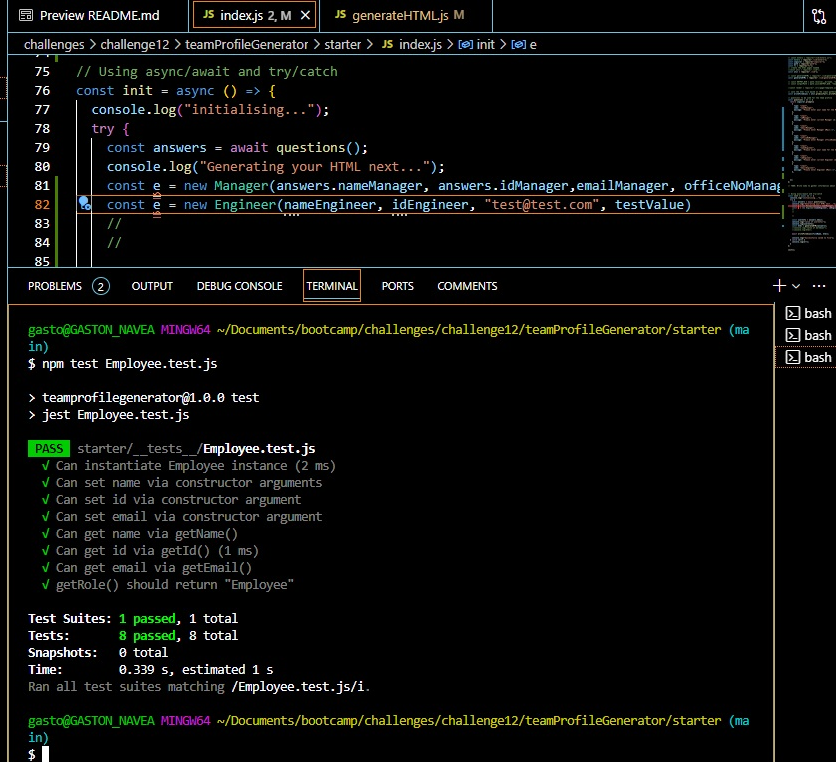
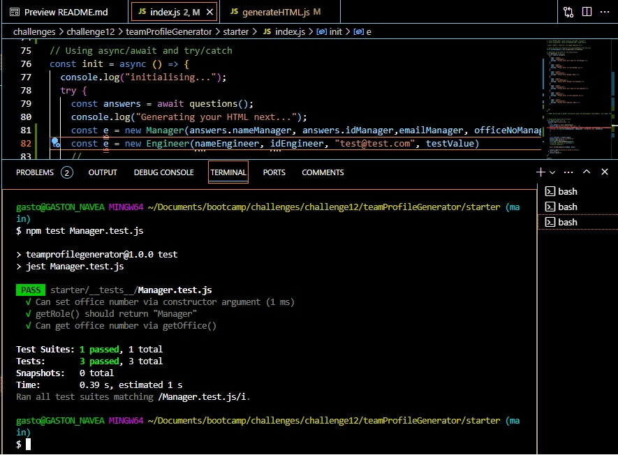
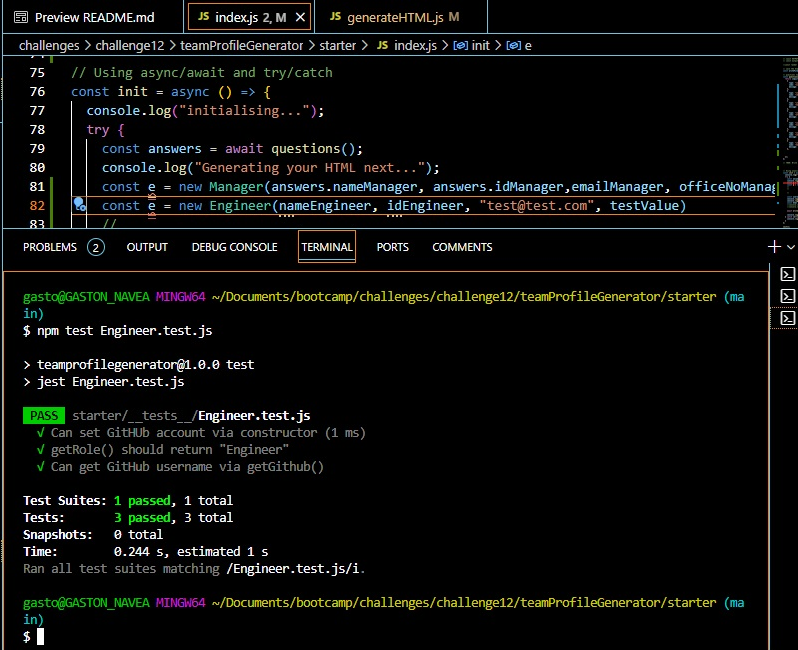
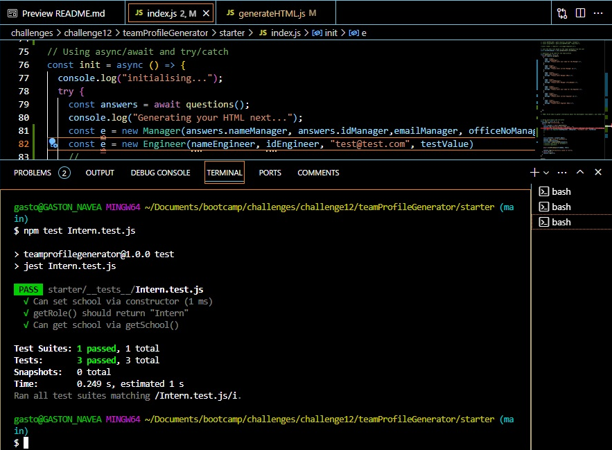

# teamProfileGenerator

The Challenge this week is to take the given starter code and convert it into a working Node.js command-line application. This application will take in information about employees on a software engineering team, then generates an HTML webpage that displays summaries for each person. Will need to ensure that the code passes all of the created tests.

## Table of Contents

- [Installation](#installation)
- [Usage](#usage)
- [Contributing](#contributing)
- [Tests](#tests)
- [License](#license)

## Installation

These are the steps required to install project:

In order to run the application it will be necesary to ensure that the following packages are preintalled before execution:

- node
- [Jest](https://www.npmjs.com/package/jest)
- [Inquirer](https://www.npmjs.com/package/inquirer)

The corresponding packge.json file will indicate the versions required to run the application

## Usage

Instructions and examples for use:

The application will use [Jest] for running the unit tests and [Inquirer] for collecting input from the user.
Make sure that once you have cloned the source code to your local environment to navigate to the starter folder.
While located at the root of the Starter folder, the application will be invoked by using the following command:

```bash
node index.js
```

## Screen captures of live application

## License

MIT

## Contributing

If you would like to contribute please contact via email as per contact information provided

## Tests

_Tests for application and how to run them:_

All tests are run using Jest and are within the _tests_ folder. Any addition to the code will need the corresponding test scripts to be added to this folder.

## Screen Capture of all Tests executed
1. Employee Class Test



2.Manager Class Test


3. Engineer Class Test



4. Intern Class Test




## Questions?

For any questions, please contact me with the information below:

through the contact information provided

Email: gus.navea@gmail.com
